[TOC]

### HW1

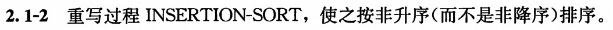

INSERTION-SORT(B)

```c
for j = 2 to A.length
  key = A[j]
  // Insert A[j] into the sorted sequence A[1..j-1]
  i = j - 1
  while i > 0 and A[j] < key
    A[i+1] = A[i]
    i = i - 1
	A[i + 1] = key
```

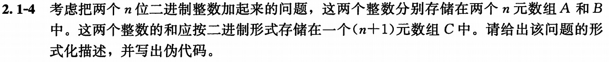

形式化描述：

输入为两个长度为n的数组A和B，其中数字均为0或1，代表两个n位二进制数a和b

输出为一个长度为(n+1)的数组C，内容代表(n+1)位二进制数a+b

ADD-N-BIT-INT

```c
save = 0
for i = n downto 1
  C[i + 1] = (A[i] + B[i] + save)%2
  if (A[i] + B[i] + save)>=2
    save = 1
  else
    save = 0
C[1] = save
```

[如果if-else分类讨论，则要考虑sum=0, 1, 2, 3的情况。]

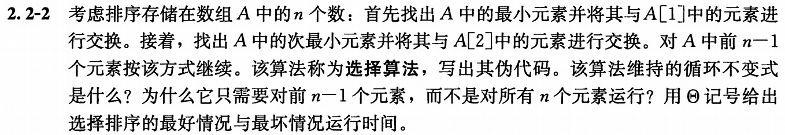

- 选择算法

```c
for i = 1 to n - 1
  min = i
  for j = i+1 to n
    if A[j] < A[i]
      min = j
  swap A[min] and A[i]
```

- 循环不变式：循环进行到任意 i 迭代开始前，都有A[1, i] 是非降序排列，A[i+1..n] 中任意数字都比前面的序列中的数字大。

  证明：

	初始化：需证明在第一次循环迭代之前，即 `i = 1` 时，循环不变式成立。此时是在A[2..n]中寻找最小，放入A[1]，此时A[i]前序列已变为升序，后面仍为乱序。
	
	保持：每次迭代后，子数组A[1..i]仍为原组成，但已按序排列。下次迭代即可保持循环不变式。
	
	终止：导致终止的是` i > n-1` ，将 i 替换为 n，注意到此时A[1..n-1]仍为原来的组成，且已经按序排列；根据算法含义，可以推知剩下的A[n]就是最大的数字，即整个数组A[1...n]已经排序。
	
- 因为第n个元素已经是剩下的最后一个元素了，谈不上如何“排序”。

- 最好情况&最坏情况：

  最好情况和最坏情况都需要遍历元素$\Theta (n^2)$，只是差了 $\Theta (n)$ 的交换。

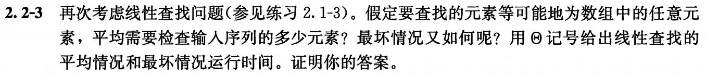

如果等可能地为任意元素，平均需要检查 $\frac{1+n}2$ 个元素；

最坏情况 n

证明：略

### HW2

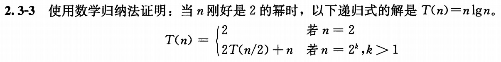

数学归纳法：

1 当 k=1 即 n=2 时，T(2) = 2*lg2 = 2 满足条件

2 假设 n = $n_k$ 时，$n_k$ 满足 T($n_k$) = $n_k$ lg$n_k$

3 当 n = $n_{k+1}$ 时，由递推公式，有

$$T(n_{k+1})=2{n_k}lg{n_k}+n_{k+1}=n_{k+1}k+n_{k+1}=n_{k+1}lgn_{k+1}$$

综上，得证。

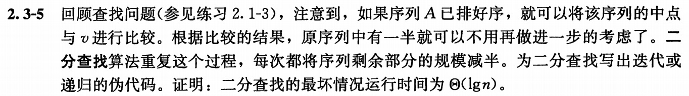

假设序列A是全局变量，为不降序列。

输入为区间的左右端点 a，b 的位置和需要比较的数字 v

```c
BinSearch(a, b, v)
if a > b
  return NIL
mid = floor((a+b)/2)
if A[mid] == v
  return mid
else if A[mid] < v
  return BinSearch(mid+1, b, v)
else
  return BinSearch(a, mid-1, v)
```

证明：

初始调用为 BinSearch(1, n, v)。由代码知，

$$T(n) = T(n/2)+c$$

由课本证明知，$T(n)$ 最坏运行情况为 $\Theta(lgn)$。

思考题：

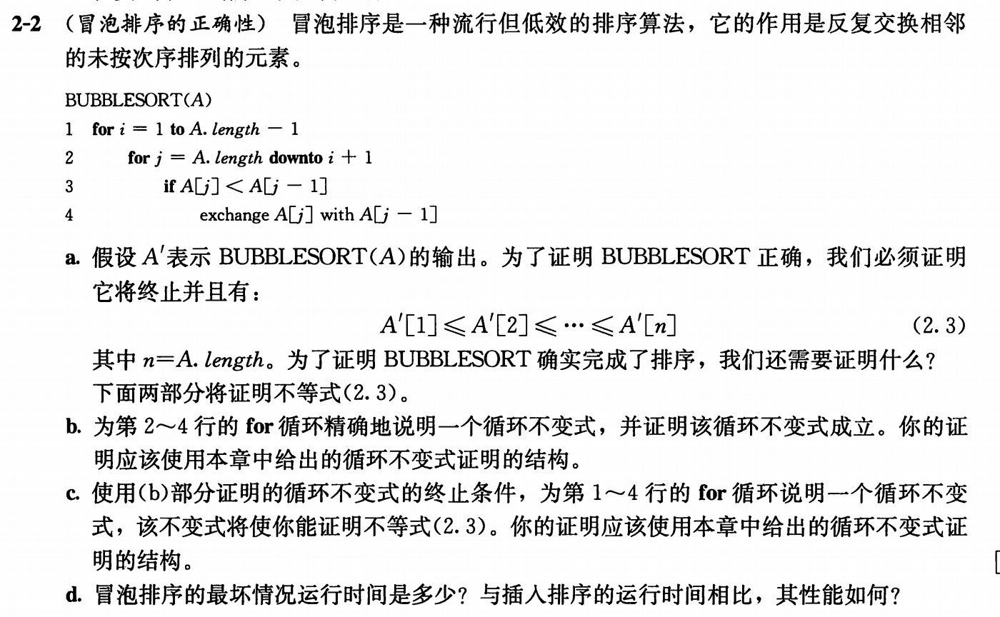

```
a We need to prove that A′ contains the same elements as A
d  the worst-case running time is Θ(n2). This is the same as that of insertion sort; however, bubble sort also has best-case running time Θ(n2) whereas insertion sort has best-case running time Θ(n).
```

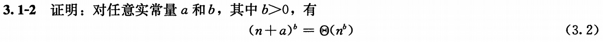

选择 $$c_2 = 2^b, n_{0} = |a|$$

$$(n+a)^b \leq 2(n+n)^b = c_2n^b$$

令$c_1 =\frac{1}2 , n_{0} = \frac{-a}{1-{\frac{1}2}^\frac{1}b}$，经变形，$n+a \geq {\frac{1}2}^\frac{1}b n$

[$n_0取2|a|之类的也可以，变形有a \geq -n/2，c_1要变为\frac{1}{2^b}$]

$$(n+a)^b \geq \frac{1}2n^b = c_1n^b$$

综上，$(n+a)^b = \Theta(n^b )$

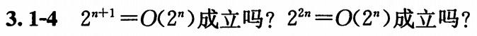

(1)式成立， $2^{n+1}\leq 2\times2^n$ 对所有自然数n成立。

(2)式不成立，不存在常数 C 满足 $2^{2n} = 2^n \times 2^n \leq C \times 2^n$。

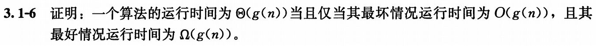

充分性：

$$由题意，存在正常量c_1和n_1，使得对所有n \geq n_1，有0 \leq f(n) \leq c_1g(n)$$

$$存在正常量c_2和n_2，使得对所有n \geq n_2，有0 \leq c_2g(n) \leq f(n) $$

$$令n_3=max(n_1,n_2)，对所有n \geq n_3，有0 \leq c_2g(n) \leq f(n) \leq c_1g(n)$$

$$得证算法的运行时间为\Theta(g(n))$$

必要性：

$$存在正常量c_1，c_2和n_0，使得对所有n \geq n_0，有0 \leq c_1g(n) \leq f(n) \leq c_2g(n) $$

左半边不等式即为最坏运行时间，右半边不等式即为最好情况运行时间。

即，最坏情况运行时间为 $O(g(n))$，最好情况运行时间为 $\Omega(g(n))$

[必要性证明也许还有可改进空间]

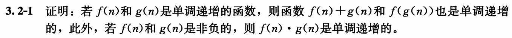

证明：

单调递增函数的定义为 $m \leq n$ 蕴含 $f(m) \leq f(n)$

由题意，当 $m \leq n$，有 $f(m) \leq f(n)$ (1)和 $g(m) \leq g(n)$ (2)

（1）(1)和(2)式相加，有 $f(m)+g(m) \leq f(n)+g(n)$，得证；

（2）当 $m \leq n$，有 $g(m) \leq g(n)$；有条件 $g(m) \leq g(n)$，有 $f(g(m)) \leq f(g(n))$，得证；

（3）当 $m \leq n$ 且 $f(x)$ 和 $g(x)$ 非负，$f(m)\times g(m) \leq f(m) \times g(n) \leq f(n) \times g(n)$，得证。

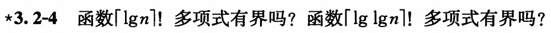

（1）无界。反证，如果多项式有界，则存在常数c，a，$n_0$，使得任何n，都有 $\lceil{lgn}\rceil! \leq cn^a$

令 $n = 2^k$，不等式化为 $k! \leq c({2^a})^k $ 与实际指数增长、阶乘增长情况矛盾。

**[重要结论]**

（2）有界。令 $n = 2^{2^k}$，有 $lglg(n) = k$

下证 $\lceil{lglgn}\rceil! \leq n$ 即 $k! \leq 2^{2^k}$

可以知道对任意正整数k， $k \le 2^k$，乘起来可以得到 $k! \leq 2^{1+...+k} \leq 2^{2^k}$。

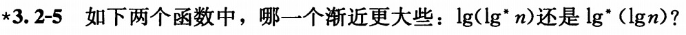

对于lg*(n)有递推公式如下：

$$lg^*(2^n) = 1+lg^*(n)$$

则有

$$lg(lg^*(2^n))=lg(lg^*(n)+1)$$

$$lg^*(lg(2^n)) = lg^*(n)$$

当 $n \to \infty，2^n \to \infty$，有 $lg^*(n) \to \infty$，相当于比较lg(n)和n哪个渐进更大。

所以 $lg^*(lgn)$ 渐进更大。

思考题

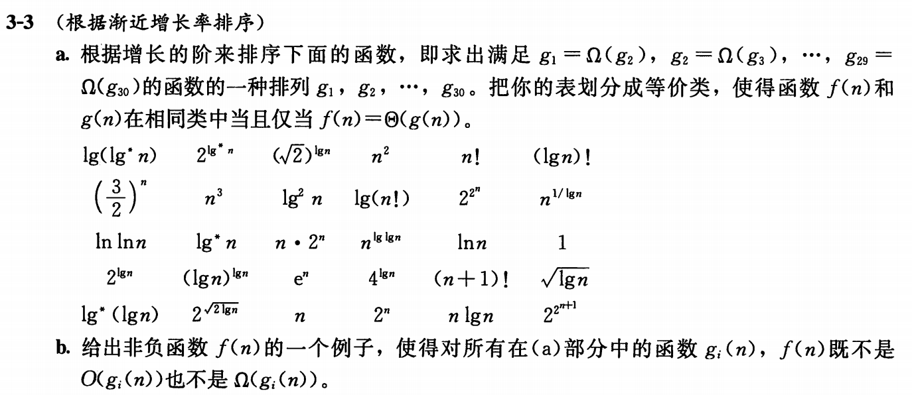

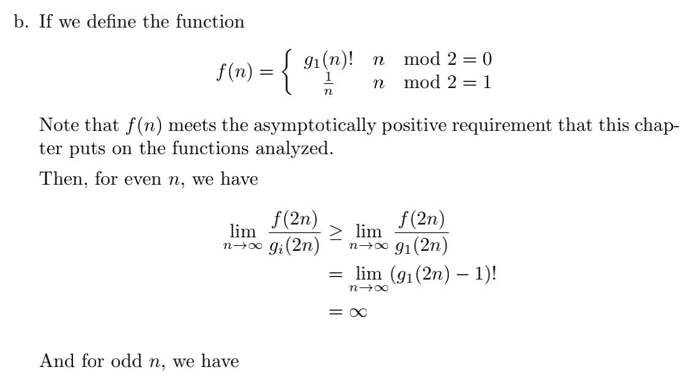

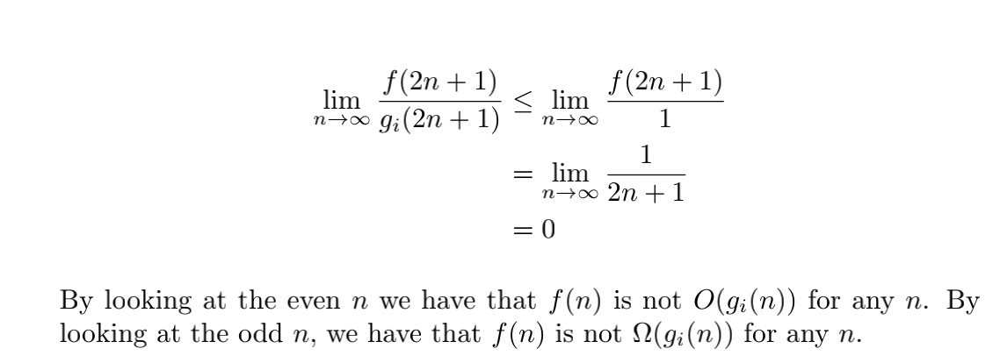

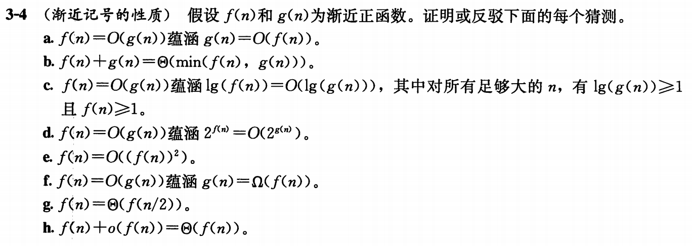

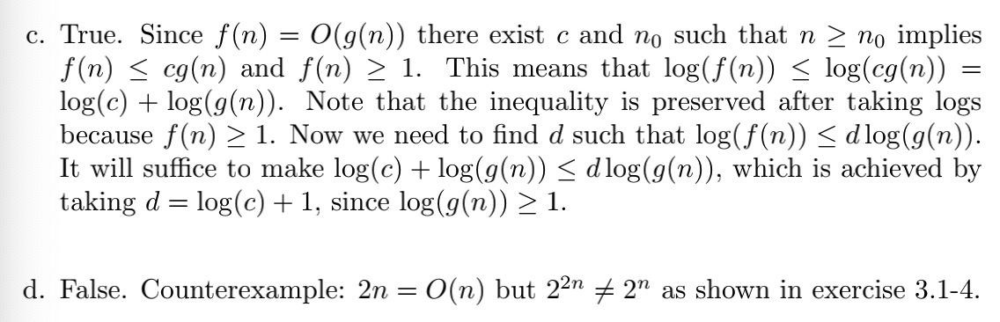

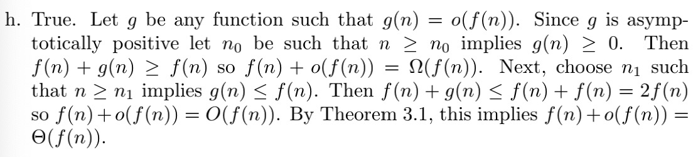

### HW3

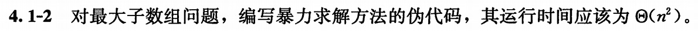

输入为长度为n的整型数组A，

输出为最大子数组的左右端点坐标和总和。

FIND-MAX-CROSSING-SUBARRAY(A, n)

```c
max = A[1]
left = 1
right = 1
for i=1 to n
  curr = 0
  for j=i to n
    curr = curr+A[j]
    if(curr > max)
      max = curr
      left = i
      right = j
return (left, right, max)
```


输入为数组A和长度n，

输出为最大子数组的左右端点坐标和总和。

{1, 2, -1, -3, -5, 10, -2}

法一

FIND-MAX-CROSSING-SUBARRAY(A, n)

```c
// 初始化(相当于 i = 1的情况)
max = A[1]
left = 1
right = 1
b = A[1]
b_left = 1
// 循环
for i = 2 to n
  // 基于A[1..j]的最大子数组和A[j+1]
  // 得出A[1..j+1]的最大子数组
  // 并记录其对应的左端点b_left
  if(b+A[i]>A[i])
    b = b+A[i]
  else
    b = A[i]
    b_left = i
	// 每步更新max，目的是求出B[1]-B[n]中的最大值
  if(b>max)
    left = b_left
    right = i
    max = b
return (left, right, max)
```

法二[不符合题意，仅作记录]

考虑存在非负项，算法足够简洁。

FIND-MAX-CROSSING-SUBARRAY-a(A, n)

```c
max = A[1]
left = 1
right = 1
i = j = 1
curr = 0
for(j = 1; j <= n; j++)
  curr = curr+A[j]
	if(A[j]<0)
		if(curr < 0)
      curr = 0
			i = j+1
	else
    if(curr > max)
      left = i
      right = j
      max = curr
return (left, right, max)
```

全为负的情况也考虑进去，

FIND-MAX-CROSSING-SUBARRAY-b(A, n)

```c
max = A[1]
left = 1
right = 1
i = j = 1
curr = 0
flag = 1
k = 1
for(j = 1; j <= n; j++)
  curr = curr+A[j]
	if(A[j]<0)
    if(A[j] > max)
      k = j
		if(curr < 0)
      curr = 0
			i = j+1
	else
    flag = 0
    if(curr > max)
      left = i
      right = j
      max = curr
if flag = 1
	return (k, k, A[k])
else
	return (left, right, max)
```


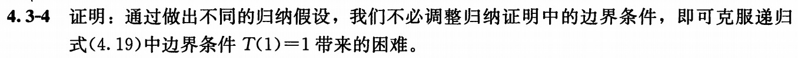

式(4.19) 如下：
$$
T(n) = 2T(\lfloor n \rfloor) + n
$$
克服边界条件 $T(1)=1$ 带来的困难只需假设 $T(n) \leq 2nlgn + 1$

此时 $T(1)=1 \leq 2lg1+1 = 1$ 满足条件。下面完成该归纳假设：

不妨只考虑 $n = 2^k$。

已知k = 0 (n = 1)成立，假设 $k = k_0$ (n/2)成立，考虑 $k = k_0+1$ (n)：
$$
\begin{align}
T(n)=&2T(\lfloor n/2 \rfloor) + n \\
		\leq& 2 \times 2n/2 \times lgn/2 + 2 + n\\
		=&2nlgn - 2n + 2 + n\\
		=&2nlgn -n + 2\\
		\leq&2nlgn + 1 (n \geq 1)\\
\end{align}
$$
得证

[注意题目条件要求”通过做出不同的归纳假设“]

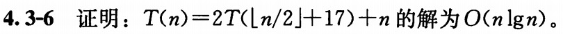

法一：思路from顾老师
$$
\begin{align}
令 n =& m+34\\
T(n)=& 2T(\lfloor n/2 \rfloor + 17) + n =>\\
T(m+34)=&2T(\lfloor m/2 \rfloor + 34) + m + 34\\
令 g(x) =& T(x+34)\\
g(m) =& T(m+34)=2T(\lfloor m/2 \rfloor + 34) + m + 34\\
		 =& 2g(\lfloor m/2 \rfloor) + m + 34\\
令 f(x) =& g(m)+34\\
f(m) =& 2f(\lfloor m/2 \rfloor) + m\\

\end{align}
$$
由课本及前面的作业题可知，f(x) 的解为 O(nlgn)，而我们要求的 T(n) 不过是将其左移 34 再下移 34 的结果，对函数的图形没有任何影响，得证。

法二：

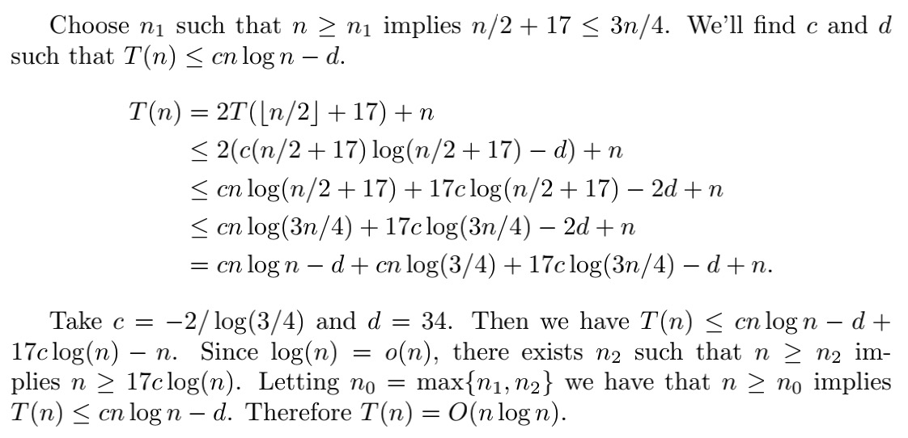


构造递归树，讨论 n 带来的代价

```
             n                         -> n
n/2+2  n/2+2  n/2+2  n/2+2             -> 2n+8
            n/4+3 n/4+3 n/4+3 n/4+3		 -> (n+12)*4
……
```

n的代价为 $\Theta(n^2)$ 

接下来考虑树的每一层的代价， 每层节点数为上一层的4倍，深度为 $\log_2{n}$，代价为 $\Theta (n^{\log_2 4}) = \Theta(n^2)$

综合考虑，取渐近上界为 $T(n) \leq cn^2 - dn$ ①

要有②式如下：
$$
\begin{align}
T(n) &= 4T(n/2+2)+n \\
		 &\leq cn^2+8cn+16c -2dn-8d +n \\
		 &= cn^2+(8c-2d+1)n+(16c-8d) 
\end{align}
$$
则 c 和 d 需满足：
$$
\begin{align}
8c-2d+1 &\leq -d \\
16c-8d &\leq 0 \\
c &\geq 0 \\
\end{align}
$$
不妨取 $c = 1 , d = 9$

得证

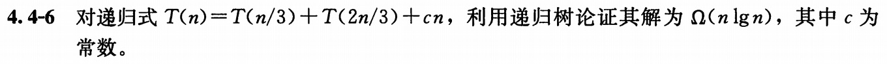

画出递归树可知，每一层 cn 带来的代价恰好就是 $cn/3+c*2n/3 = cn$

而最小层数为 $\log_3n$ （即一路沿着 T(n/3) 项向下走）
$$
\begin{align}
T(n) &\geq cn \times \log_3n \\
	   &= c/lg3 \times nlgn \\
T(n) &=\Omega(nlgn)
\end{align}
$$
得证

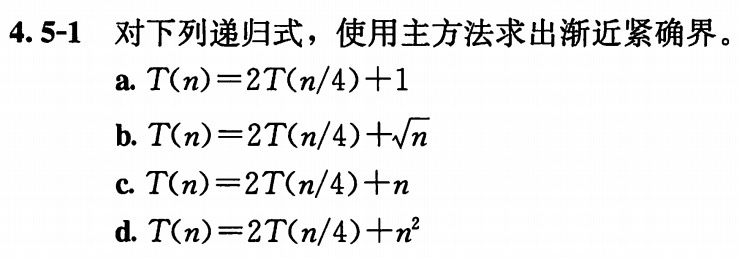

a.
$f(n) = 1 = O(n^{\log_4{2}-\epsilon}) = O(n^0) , when  \epsilon =1/2$ 

$T(n) = \Theta(\sqrt{n})$

b.

$f(n) = \sqrt{n} = \Theta(n^{\log_4{2}}) = \Theta(\sqrt{n})$

$T(n) = \Theta(\sqrt{n}lgn)$

c.

$f(n) = n = \Omega(n^{\log_4{2}+\epsilon}) = \Omega(n^{3/4}), when \epsilon=1/4$

且对 c = 1/2 和所有足够大的 n 有 $2(n/4) \leq cn = n/2$

$T(n) = \Theta(n)$

d.

$f(n) = n^2 = \Omega(n^{\log_4{2}+\epsilon}) = \Omega(n^{3/4}), when \epsilon=1/4$

且对 c = 1/2 和所有足够大的 n 有 $2(n/4)^2 \leq cn^2 = n^2/2$

$T(n) = \Theta(n^2)$

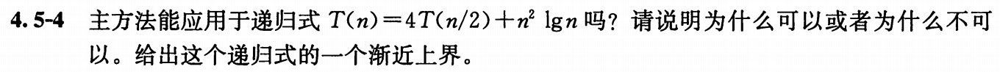

[不确定哪个对]

法一：

能，考虑情况2的推广情况：若 $f(n) = \Theta(n^{\log_ba} log^kn)$，则 $T(n) = \Theta(n^{\log_ba} log^{k+1}n)$

在本题中，有 $T(n) = \Theta(n^2 log^2n)$

法二：

不能

因为函数 $f(n) = n^2lgn$ 落入了主方法情况 2 和情况 3 的间隙中。

求和可以知道 $n^2lgn$ 前面的系数以不高于 1/4 等比级数收敛，代价为 $\Theta(n^2lgn)$ 

接下来考虑树的每一层的代价， 每层节点数为上一层的4倍，深度为 $\log_2{n}$，代价为 $\Theta (n^{\log_2 4}) = \Theta(n^2)$

综合考虑，这个递归式的一个渐近上界为 $T(n) \leq cn^2lgn$ 

[参考答案]

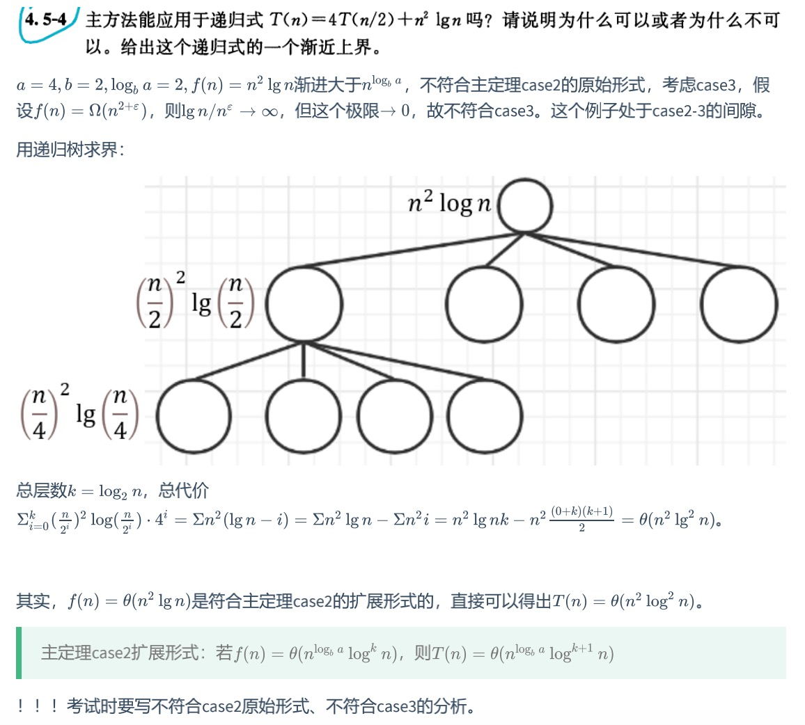

[补充练习]
$$
T(n) = 2T(n/2)+nloglogn\\
T(n) = 4T(n/2)+n^2/logn
$$

都落入了间隙，采用递归树法

[补充练习]

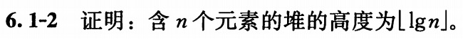

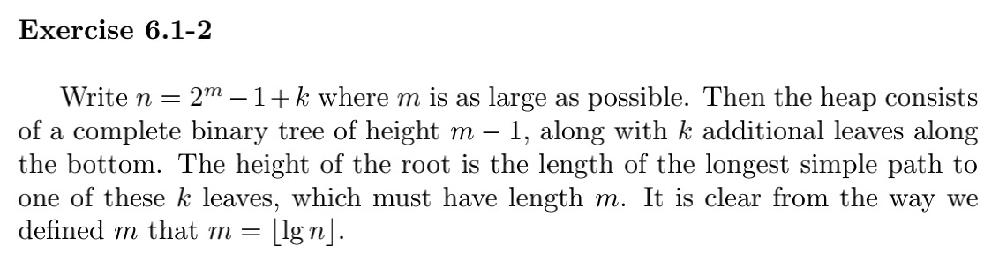


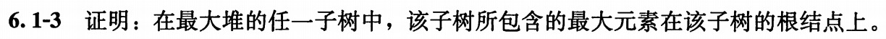

反证，如果存在最大元素不在子树根节点上，它必然有父节点。由最大堆的定义，所有除了根以外的节点都满足父节点大于等于其子节点。矛盾，原假设成立，得证。

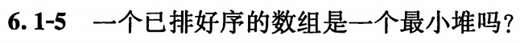

是。

排好序的数组满足每一个数字对都有前面不大于后面。将其转化为堆时可以发现每一层都不小于其上一层任何元素，肯定满足“A[PARENT(i)]>=A[i]”。

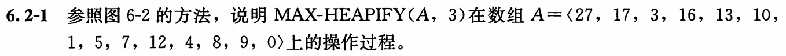

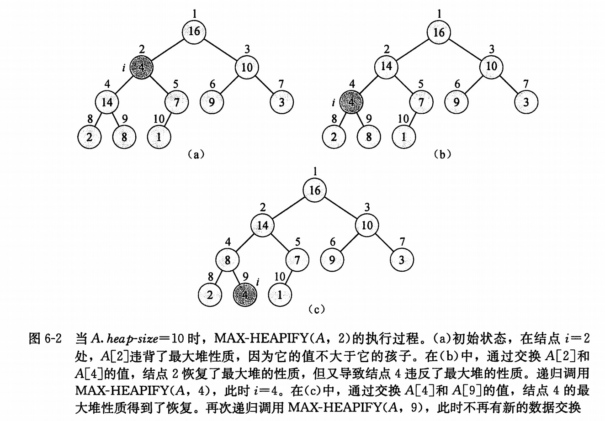

(a) 在结点 i = 3 处，A[3] 违背了最大堆性质，因为它的值不大于它的孩子。

|      |      |      | 27   |          |      |      |      |
| ---- | ---- | ---- | ---- | -------- | ---- | ---- | ---- |
|      |      | 17   |      | <u>3</u> |      |      |      |
|      | 16   | 13   |      | 10       |      | 1    |      |
| 5    | 7    | 12   | 4    | 8        | 9    | 0    |      |

(b) 通过交换 A[3] 和 A[6] 的值，结点 3 恢复了最大堆的性质，但导致结点 6 违反了最大堆性质。递归调用 MAX-HEAPIFY(A, 6)，此时 i = 6。

|      |      |      | 27   |          |      |      |      |
| ---- | ---- | ---- | ---- | -------- | ---- | ---- | ---- |
|      |      | 17   |      | 10       |      |      |      |
|      | 16   | 13   |      | <u>3</u> |      | 1    |      |
| 5    | 7    | 12   | 4    | 8        | 9    | 0    |      |

(c) 通过交换 A[6和 A[13] 的值，结点 6 恢复了最大堆的性质。递归调用 MAX-HEAPIFY(A, 13)，此时不再有新的数据交换。

|      |      |      | 27   |      |          |      |      |
| ---- | ---- | ---- | ---- | ---- | -------- | ---- | ---- |
|      |      | 17   |      | 10   |          |      |      |
|      | 16   | 13   |      | 9    |          | 1    |      |
| 5    | 7    | 12   | 4    | 8    | <u>3</u> | 0    |      |

数组最终为：

|      |      |      |      |      |      |      |      |      |      |      |      |      |      |
| ---- | ---- | ---- | ---- | ---- | ---- | ---- | ---- | ---- | ---- | ---- | ---- | ---- | ---- |
| 27   | 17   | 10   | 16   | 13   | 9    | 1    | 5    | 7    | 12   | 4    | 8    | 3    | 0    |

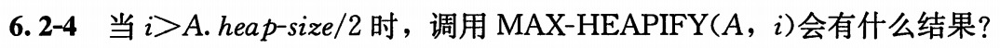

i > A.heap-size/2 则其对应的 l = LEFT(i) 以及 r = RIGHT(i) 都不满足 if 判断语句，什么都不发生，递归结束。

从数字上考虑，i 超过一半说明 i 已经是叶结点了，调用 MAX-HEAPIFY 当然什么都不会发生，因为叶结点一定满足最大堆条件。


### HW4

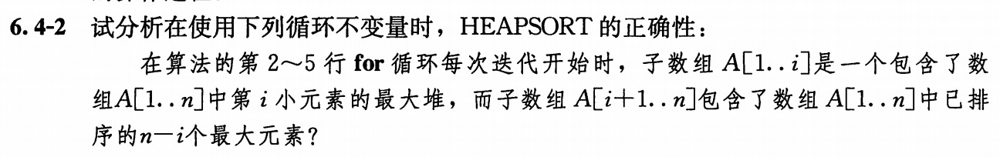

初始化：开始时，子数组 A[1..n] 是一个包含了数组 A[1..n] 中 n 小元素的最大堆，而子数组 A[n+1..n] 包含了数组 A[1..n] 中已排序的 0 个最大元素；

保持：如果子数组 A[1..i] 是一个包含了数组 A[1..n] 中 i 小元素的最大堆，而子数组 A[i+1..n] 包含了数组 A[1..n] 中已排序的 n-i 个最大元素；那么，经过第三行 exchange 后，位于 A[1] 的第 n-i+1 大的元素被换至 A[i-1]，子数组 A[1..i-1] 是一个包含了数组 A[1..n] 中 i-1 小元素的最大堆，而子数组 A[i..n] 包含了数组 A[1..n] 中已排序的 n-i+1 个最大元素；

终止：当 i = 2时，AP1] 与 A[2] 交换，子数组 A[1..1] 是一个包含了数组 A[1..n] 中 第 1 小元素的最大堆，而子数组 A[2..n] 包含了数组 A[1..n] 中已排序的 n-1 个最大元素，最后的 A[1] 是最小元素，整个数组排序完成。

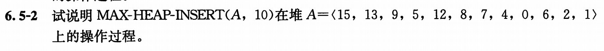

| 1    | 2    | 3    | 4    | 5    | 6    | 7    | 8    | 9    | 10   | 11   | 12   | 13   |
| ---- | ---- | ---- | ---- | ---- | ---- | ---- | ---- | ---- | ---- | ---- | ---- | ---- |
| 15   | 13   | 9    | 5    | 12   | 8    | 7    | 4    | 0    | 6    | 2    | 1    | -1   |
| 15   | 13   | 9    | 5    | 12   | 8    | 7    | 4    | 0    | 6    | 2    | 1    | 10   |
| 15   | 13   | 9    | 5    | 12   | 10   | 7    | 4    | 0    | 6    | 2    | 1    | 8    |
| 15   | 13   | 10   | 5    | 12   | 9    | 7    | 4    | 0    | 6    | 2    | 1    | 8    |

第 1 行：A.heap-size 增加1，第 13 号位置写入一个代表负无穷的数字（例如 -1），此时仍为最大堆。

第2-4 行：通过 HEAP-INCREASE-KEY 将 -1 增加为 10，交换 A[13] 和它的 PARENT 结点 A[6]，再交换 A[6] 和它的 PARENT 结点 A[3]，与 A[1] 比较后终止。

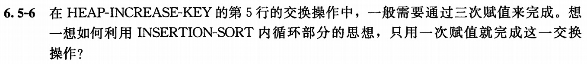

HEAP-INCREASE-KEY(A, i, key)

```c
if key < A[i]
  error
//A[i] = key
while i>1 and A[PARENT(i)] < key
  //exchange A[i] with A[PARENT(i)]
  A[i] = A[PARENT(i)]
  i = PARENT(i)
A[i] = key
```

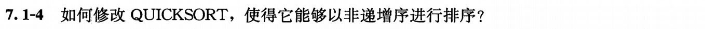

将 PARTITION 中第 4 行 $\leq$ 改为 $\geq$ 即可。

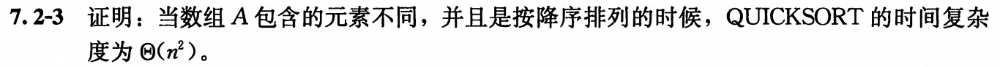

考虑 PARTITION 的实现，当最后一个元素是最小元素时，PARTITION 会将其划分为 n-1 和 0 两个子数组，正是书上讨论过的最坏情况，即为 $\Theta(n^2)$

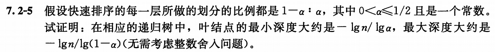

最小深度是一直用 α 走下去的分支，最大深度是一直用 1-α 走下去的分支。

$h_{min} = \log_{\alpha}{1/n} = -lgn/lg \alpha$

$h_{max} = \log_{1-\alpha}{1/n} = -lgn/lg(1- \alpha)$

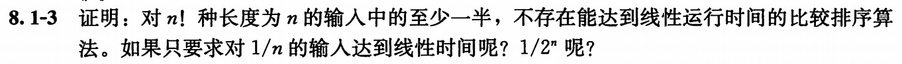

（1）反证：如果对 n! 种长度为 n 的输入中的至少一半，存在能达到线性运行时间的比较排序算法，则有 $k \geq n!/2$ 种情况下深度不超过 cn​，c 为常数。

但深度不超过 cn 的节点总数不可能超过 $2^{cn+1}$

即有 $n!/2 \leq 2^{cn+1}$，其中 c 为一常数，与 Stirling 公式的推论 $\log (n!)=\Theta(n \log n)$ 矛盾。

假设不成立，原命题得证。

（2）仍反证，可以同理得到 $(n-1)! \leq 2^{cn+1}$，把 n-1 替换为 n，与（1）的情形相似，假设不成立，不存在。

（3）仍反证，可以同理得到 $n!/2^n \leq 2^{cn+1}$，作变换，$n! \leq 2^{c’n+1}$，c' 为常数，与（1）情形相似，假设不成立，不存在。

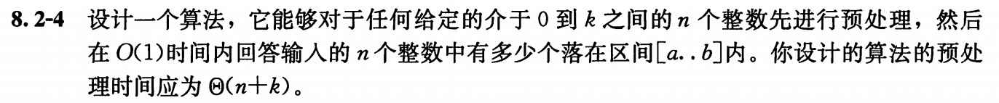

要在 O(1) 时间内实现，预处理的结果中，对任意 i，Ans[i] 的含义为 n 个整数有多少个落在区间 [1..i] 内。这样，只需一步 Ans[b] - Ans[a-1] 即可。

课本上的 COUNTING-SORT(A, B, k) 的输出数组的含义即为所求。

### HW5

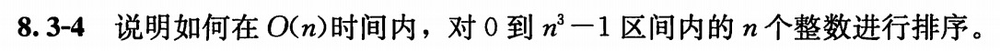

这里 $n^3$ 可以换作 b = $\lceil 3lgn \rceil$ 位的二进制数，b > lg n​ 则取 r = $\lfloor lgn \rfloor$ 

由引理8.4，经计算，可以在 $\Theta(n)$ 内排好序，也即 O(n)

[也可以转为n进制共三位]


1）如果桶排序时所有数字在同一个链表中，等价于插入排序，最坏情况下运行时间是 $\Theta(n^2)$

2）只需将桶排序中链表插入排序改为归并排序。

①先证明 $T(n) = \Theta(n) + \Sigma O(n_i\lg n_i) = \Theta(n)$：

因为 $n_ilgn_i \leq n_i^2$

若有 $T(n) = \Theta(n) + \Sigma O(n_i\lg n_i) \leq \Theta(n) + \Sigma O(n_i^2) = \Theta(n)$ 则可得证

而右式即为桶排序平均情况的推导，课本已证为 $\Theta(n)$；左式也至少为 $\Theta(n)$，新算法仍为线性代价。

②再证明最坏情况 O(nlgn)：

直觉上，我们先考虑元素集中于一个桶中的情况，有 $T(n) = \Theta(n) + \Sigma O(n_i\lg n_i) = \Theta(n)+O(nlgn) = O(nlgn)$

再考虑普遍情况，$T(n) = \Theta(n) + \Sigma O(n_i\lg n_i) \leq \Theta(n)+O(n_ilgn) = \Theta(n)+O(nlgn) = O(nlgn)$

综上，最坏情况下时间代价为 O(nlgn)。

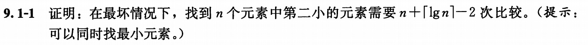

核心：用完全二叉树，两两比较，较小的升入上层。

易知叶结点（初始元素）有n个，非叶结点（比较）有 n-1 个（因为除根节点都需要比较一次，即 n-1 次比较找出了最小元素），有 $\lceil lgn \rceil+1$ 层元素。

次小一定出自被最小击败过的节点，所以在所有被最小元素比较过的 $\lceil lgn \rceil$ 个元素中找出最小的，遍历过程中比较 $\lceil lgn \rceil-1$ 次（-1因为有一个是初值），即为次小。

[补充要求：自己写出完整的算法]


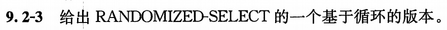

ITERATIVE-RANDOMIZED-SELECT(A, p, r, i)

```c
while(p<r)
  q = RANDOMIZED-PARTITION(A, p, r)
  k = q-p+1
  if i == k
    return A[q]
  else if i < k
    r = q-1
  else
    p = q+1
    i = i-k
return A[p]
```

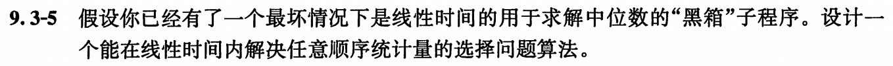

RANDOMIZED-SELECT(A, p, r, i)

```c
if p == r
  return A[p]
q = PARTITION(A, p, r)
k = q-p+1
if i == k
  return A[q]
else if i < k
  return RANDOMIZED-SELECT(A, p, q-1, i)
else
  return RANDOMIZED-SELECT(A, q+1, r, i-k)
```

和原来的 RANDOMIZED-SELECT 的算法几乎完全一样，但因为这里应用的“黑箱” PARTITION 程序，q 即为中位数，每次递归范围减半，复杂度 T(n) = n + n/2 + n/4 + …… = $\Theta(n)$（等比数列求和）

此即为一个能在线性时间内解决任意顺序统计量的选择问题算法。

[思考题]

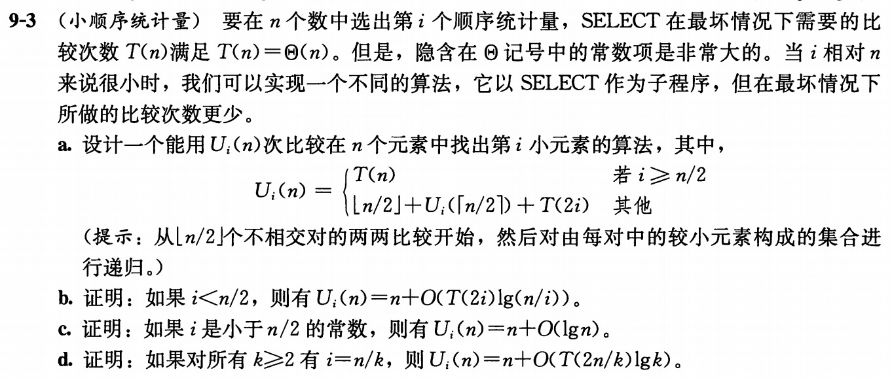

a. $\lfloor n/2 \rfloor$ 个不相交对两两比较（$\lfloor n/2 \rfloor$），对每队中较小元素（共 $\lfloor n/2 \rfloor$ 个）找出第 i 小元素（$U_i(\lceil n/2 \rceil)$），此时已经排序，前 i 小对（共 2i 个）需要 T(2i) 选出第 i 小。

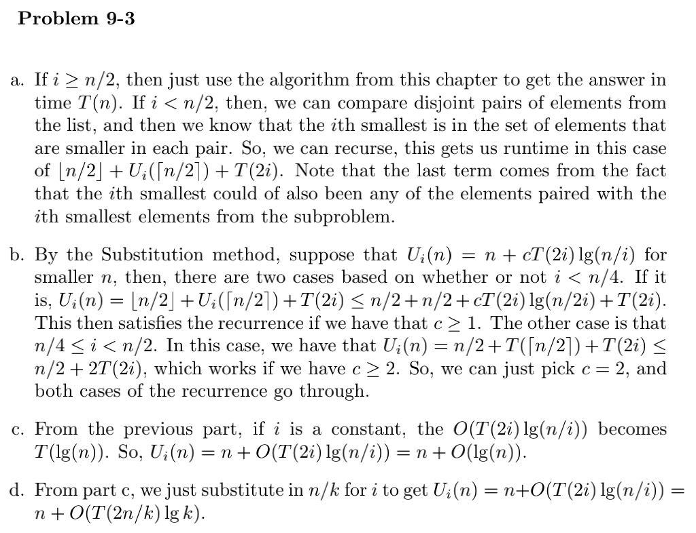

### HW6

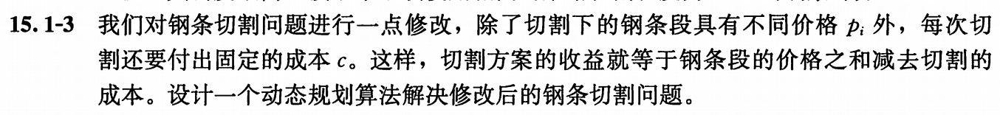

采用自底向上版本

BOTTOM-UP-CUT-ROD(p, n)

```c
let r[0..n] be a new array
r[0] = 0
for j = 1 to n
  q = -oo
  for i = 1 to j-1
    q = max(q, p[i]+r[j-i]-c)
  q = max(q, p[j]) // 不切割的特殊情况
  r[j] = q
return r[n]
```

其实就是在切割的情况的收益处减去了切割成本。

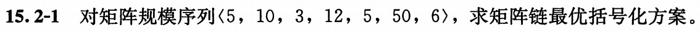

使用 MATRIX-CHAIN-ORDER 算法，

|      | 1    | 2      | 3      | 4      | 5       | 6       |
| ---- | ---- | ------ | ------ | ------ | ------- | ------- |
| 1    | 0    | 150, 1 | 330, 2 | 405, 2 | 1655, 4 | 2010, 2 |
| 2    |      | 0      | 360, 2 | 330, 2 | 2430, 2 | 1950, 2 |
| 3    |      |        | 0      | 180, 3 | 930, 4  | 1770, 4 |
| 4    |      |        |        | 0      | 3000, 4 | 1860, 4 |
| 5    |      |        |        |        | 0       | 1500, 5 |
| 6    |      |        |        |        |         | 0       |

$$
\begin{align}
[1,3] = min(&[1,1]+[2,3]+p_0p_1p_3 = 360+600 = 960,\\
						&[1,2]+[3,3]+p_0p_2p_3 = 150+180 = 330) = 330\\
[2,4] = min(&[2,2]+[3,4]+p_1p_2p_4 = 180+150 = 330,\\
						&[2,3]+[4,4]+p_1p_3p_4 = 360+600 = 960) = 330\\
[3,5] = min(&[3,3]+[4,5]+p_2p_3p_5 = 3000+1800 = 4800,\\
						&[3,4]+[5,5]+p_2p_4p_5 = 180+750 = 930) = 930\\
[4,6] = min(&[4,4]+[5,6]+p_3p_4p_6 = 1500+360 = 1860,\\
						&[4,5]+[6,6]+p_3p_5p_6 = 3000+?) = 1860\\
[1,4] = min(&[1,1]+[2,4]+p_0p_1p_4 = 330+250 = 580,\\
						&[1,2]+[3,4]+p_0p_2p_4 = 330+75 = 405,\\
						&[1,3]+[4,4]+p_0p_3p_4 = 330+300 = ?) = 405\\
[2,5] = min(&[2,2]+[3,5]+p_1p_2p_5 = 930+1500 = 2430,\\
						&[2,3]+[4,5]+p_1p_3p_5 = 3360+？,\\
						&[2,4]+[5,5]+p_1p_4p_5 = 330+2500 = 2830） = 2430\\
[3,6] = min(&[3,3]+[4,6]+p_2p_3p_6 = 1860+216 = 2076,\\
						&[3,4]+[5,6]+p_2p_4p_6 = 180+1500+90 = 1770,\\
						&[3,5]+[6,6]+p_2p_5p_6 = 930+900 = 1830） = 1770\\
[1,5] = min(&[1,1]+[2,5]+p_0p_1p_5 = 2430+2500 = 4930,\\
						&[1,2]+[3,5]+p_0p_2p_5 = 1080+750 = 1830,\\
						&[1,3]+[4,5]+p_0p_3p_5 = ?,\\
						&[1,4]+[5,5]+p_0p_4p_5 = 405+1250 = 1655) = 1655\\
[2,6] = min(&[2,2]+[3,6]+p_1p_2p_6 = 1770+180 = 1950,\\
						&[2,3]+[4,6]+p_1p_3p_6 = ?,\\
						&[2,4]+[5,6]+p_1p_4p_6 = 330+1500+300=?,\\
						&[2,5]+[6,6]+p_1p_5p_6 = 2430+?=?) = 1950\\
[1,6] = min(&[1,1]+[2,6]+p_0p_1p_6 = 1950+300 = 2250,\\
						&[1,2]+[3,6]+p_0p_2p_6 = 150+1770+90 = 2010,\\
						&[1,3]+[4,6]+p_0p_3p_6 = ?,\\
						&[1,4]+[5,6]+p_0p_4p_6 = 1905+150 = 2055,\\
						&[1,5]+[6,6]+p_0p_5p_6 = 1655+1500 = ?) = 2010
\end{align}
$$

(注：? 处是不需要算完就知道没有计算价值的内容)

得到 [1,6] 的切分为 $(A_1 A_2) ((A_3 A_4) (A_5 A_6))$


1）考虑 n*n 的表格，顶点有1+2+...+n = n(n+1)/2 个，每个 $1 \leq i \leq j \leq n$ 都有满足题意的顶点坐标 (i, j)。

2）(i, j)->(m, n) 存在有向边，当满足 $m = i, m \leq n < j || n = j, i < m \leq j$

$\Sigma \Sigma 2(j-i) = \Sigma_{k=0}^{n-1} 2k(n-k)$  (令 k = j-1) 
$$
= \Sigma_{k=0}^{n-1} 2kn-2k^2 = n^2(n-1)-2(n-1)n(2n-1)/6\\
= n^3-n^2-n/3*(2n^2-3n+1) = (n^3-n)/3
$$
（注：平方和公式为 $\Sigma_{k=1}^n k^2 = n(n+1)(2n+1)/6$）

$(n^3-n)/3$ 即为边数。


仍具有最优子结构性质。

我们只需要将之前最小化的过程，取最小变为取最大即可。反证：因为任何对A1, ... An 的分割，如果子部分不会最大化情况，一定存在更大的情况，可以剪切粘贴在该处，得出矛盾，原命题成立。


| p0   | p1   | p2   | p3   | p4   |
| ---- | ---- | ---- | ---- | ---- |
| 1000 | 1000 | 10   | 5    | 10   |

结果是 $((A_1 A_2) A_3) A_4 = 1000*1000*10+1000*10*5+1000*5*10 = 10010000$

随便找一种取法 $((A_1 (A_2 A_3)) A_4) = 1000*100*5+1000*1000*5+1000*10*5 = 5550000$ 就会发现比它更优。


用一个 $O(n^2)$ 的排序算法将 n 个数的序列另外排出一个单调递增的序列，再对两个序列求最长公共子序列。

LONG-INCREASING-SUBSEQUENCE (X, n)

```c
申请长度为 n 的整型数组 Y，拷贝 X 的内容，并调用复杂度为 O(n2) 的排序算法对 Y 排序
ICS-LENGTH(X,Y)
```

### HW7


n=7

| e    | 0    | 1    | 2    | 3    | 4    | 5    | 6    | 7    |
| ---- | ---- | ---- | ---- | ---- | ---- | ---- | ---- | ---- |
| 1    | 0.06 | 0.28 | 0.62 | 1.02 | 1.34 | 1.83 | 2.44 | 3.12 |
| 2    |      | 0.06 | 0.3  | 0.68 | 0.93 | 1.41 | 1.96 | 2.61 |
| 3    |      |      | 0.06 | 0.32 | 0.57 | 1.04 | 1.48 | 2.13 |
| 4    |      |      |      | 0.06 | 0.24 | 0.57 | 1.01 | 1.55 |
| 5    |      |      |      |      | 0.05 | 0.3  | 0.72 | 1.2  |
| 6    |      |      |      |      |      | 0.05 | 0.32 | 0.78 |
| 7    |      |      |      |      |      |      | 0.05 | 0.34 |
| 8    |      |      |      |      |      |      |      | 0.05 |

| w    | 0    | 1    | 2    | 3    | 4    | 5    | 6    | 7    |
| ---- | ---- | ---- | ---- | ---- | ---- | ---- | ---- | ---- |
| 1    | 0.06 | 0.16 | 0.28 | 0.42 | 0.49 | 0.64 | 0.81 | 1    |
| 2    |      | 0.06 | 0.18 | 0.32 | 0.39 | 0.54 | 0.71 | 0.9  |
| 3    |      |      | 0.06 | 0.2  | 0.27 | 0.42 | 0.59 | 0.78 |
| 4    |      |      |      | 0.06 | 0.13 | 0.28 | 0.45 | 0.64 |
| 5    |      |      |      |      | 0.05 | 0.2  | 0.37 | 0.56 |
| 6    |      |      |      |      |      | 0.05 | 0.22 | 0.41 |
| 7    |      |      |      |      |      |      | 0.05 | 0.24 |
| 8    |      |      |      |      |      |      |      | 0.05 |

| root | 1    | 2    | 3    | 4    | 5    | 6    | 7    |
| ---- | ---- | ---- | ---- | ---- | ---- | ---- | ---- |
| 1    | 1    | 2    | 2    | 2    | 3    | 3    | 5    |
| 2    |      | 2    | 3    | 3    | 3    | 5    | 5    |
| 3    |      |      | 3    | 3    | 4    | 5    | 5    |
| 4    |      |      |      | 4    | 5    | 5    | 6    |
| 5    |      |      |      |      | 5    | 6    | 6    |
| 6    |      |      |      |      |      | 6    | 7    |
| 7    |      |      |      |      |      |      | 7    |

从表格中知道代价是e[1,7] = 3.12

结构：

|      |      |      | 5    |      |      |      |      |
| ---- | ---- | ---- | ---- | ---- | ---- | ---- | ---- |
|      | 2    |      |      |      |      | 7    |      |
| 1    |      | 3    |      |      | 6    |      |      |
|      |      |      | 4    |      |      |      |      |

思考题：


（暂跳过）


其实本质是一样的。

先要证明：考虑任意非空子问题 $S_k$，令 $a_m$ 是 $S_k$ 中开始时间最晚的活动，则 $a_m$ 在 $S_k$ 的某个最大兼容活动子集中。

证明：对 S 用开始时间升排列。令 $A_k$ 是 $S_k$ 的一个最大兼容活动子集，且 $a_j$ 是 $A_k$ 中开始时间最晚的活动。若 $a_j = a_m$ 则已经证明；若不等，令集合 $A'_k = A_k - \{a_j\}+\{a_m\}$ ，即将 $A_k$ 中 $a_j$ 替换为 $a_m$ 。$A'_k$ 的活动都是不相交的。$a_j$ 是 $A_k$ 中开始时间最晚的活动，而 $s_j \leq s_m$。由于 |$A'_k$|=|$A_k$|，得出 $A'_k$ 也是一个最大兼容活动子集，且包含 $a_m$。

贪心算法的修改类似，n 个活动按开始时间单调递增顺序排列，从后往前遍历，不断取出满足条件的活动。

### HW8


反证：假设存在一颗不满的二叉树是最优的。

一颗不满的二叉树内存在一个结点只有一个孩子，只需将该结点替换为其孩子结点，孩子结点以及其子辈的深度都会减一，代价更少，与“最优”的假设矛盾，假设不成立，原命题成立，得证。


由最优前缀码知，其对应的编码树有 2|C|-1 个结点，用先序/中序/后序表示都差不多，需要 2n-1 位来表示其结构，具体可以用 0 代表非叶结点，1 代表是叶结点；

而范围为 0 ~ n-1 的编码，二进制表示仅需 $\lceil lgn \rceil$ 位，对于字母表中 n 个字符，可以用 $n\lceil lgn \rceil$ 位对应之前的序列所表示的结构。

综合起来，前面 2n-1 位表示结构，后面其余表示结构中的结点分别是字母表中哪个。


只需构造一个 $\Theta(nk)$ 的例子。

假设初始值为 100……00 (k-1 个 0)，n个操作为 DECREMENT 和 INCREMENT 交替，可以知道总共运行时间约为 $ n/2 * k + n/2 * k=\Theta(nk)$


每次 INCREMENT 操作的代价中都留 1 为信用，因为不管 INCREMENT 涉及到多少位，最终停下来的时候，经过的都复位为 0，而最高位的 1 复位时代价为 1；相比课本的 INCREMENT，还多了大小为 1 的代价，因为要多一步记录最高位的 1 在哪里。

RESET 操作的代价可以设为 0，复位最高位的时候用 INCREMENT 的信用即可。

此时，任意 n 个 INCREMENT 和 RESET 的代价可以认为不超过 2n + n 个 INCREMENT（由前知为 O(n)）即 O(n)。

[其实不管多加了2n还是cn，都不影响O(n)这个结论]


设势函数为 nlgn，INSERT 本身代价为 O(lgn)，n 增长 1 之后势函数也增长约 O(lgn)，摊还代价为 O(lgn)。

虽然 EXTRACT-MIN 本身代价为 O(lgn)，n 减少 1 之后势函数也减少约 O(lgn)，摊还代价为 O(1)。


设 m 为比 n 大的第一个 2 的幂，而矩阵规模 n 不是 2 的情况可以扩展为规模为 m 的情况，$m \leq 2n$

下证 m 时运行时间为 $\Theta(n^{lg7})$
$$
m^{lg7} \leq (2n)^{lg7} = 7n^{lg7}\\
m^{lg7} \geq n^{lg7}
$$
得证。


利用 $c_j = \Sigma_{k=0}^j a_kb_{j-k}$

|       | 6    | 5    | 4    | 3    | 2    | 1    | 0    |
| ----- | ---- | ---- | ---- | ---- | ---- | ---- | ---- |
| $a_k$ |      |      |      | 7    | -1   | 1    | -10  |
| $b_k$ |      |      |      | 8    |      | -6   | 3    |
| $c_k$ | 56   | -8   | -34  | -53  | -9   | 63   | -30  |


假设 A 的系数为 $a_0 ... a_{n-1}$，q(x) 的系数为 $q_0 ... q_{n-2}$，显然 $q_{n-2} = a_{n-1}$

后续 $q_k = a_{k+1}+q_{k+1} \times x_0$，k 从 n-3 递减到 0，$r = a_0+q_0 \times x_0$

显然计算时间复杂度为 $\Theta(n)$

### HW9


$\omega_n = \omega_4$

$w_4^0 = 1,w_4^1 = i,w_4^2 = -1, w_4^3 = -i$

由公式 $y_k = A(\omega_n^k)=\Sigma_{j=0}^{n-1} a_j \omega_n^{kj}$

DFT为 (6, -2-2i, -2, 2i-2)


$(\omega_n^{k+n/3})^3 = \omega_n^{3k+n} = \omega_n^{3k}$

分治策略把系数分为 3 份，$A^{[i]} = \Sigma_{j=0}^{n/3-1}a_{i+3k}x^j$

有 $A(x)=A^{[0]}(x^3)+xA^{[1]}(x^3)+x^2A^{[2]}(x^3)$

递归式为 $T(n) = 3T(n/3)+\Theta(n) = \Theta(nlgn)$


n = 8

BIT-REVERSE-COPY A = (0, 4, 3, 7, 2, 5, -1, 9)

注意：n次单位根计算公式为 $cos(2k\pi/n)+isin(2k\pi/n)$

第一层循环三次。第一次 s = 1 时，m = 2, $\omega_m$ = -1, j = 0, A = (4, -4, 10, -4, 7, -3, 8, -10)

第二次 s = 2 时，m = 4, $\omega_m = i$ , k = 0或4, j = 0~1, A = (14, -4-4i, -6, -4+4i, 15,-3-10i, -1,-3+10i)

第三次 s = 3 时，m = 8, $\omega_m = (i+1)/\sqrt{2}$ , k = 0, j = 0~3, 

A =


不同：二分检索树要求了左子树所有元素都不大于结点大小，右子树所有元素都不小于结点大小。最小堆只要求了结点小于其他所有元素。

不可以。最简单的原因就是最小堆没有对左右子树做出限定，我们不知道次小元素在哪（没有足够好的patern）。


只要让这个二分检索树的根节点是最小的数组，就可以违反 a<=b 这个条件，例如


不可交换。


### HW10


是。

原松弛红黑树T已经满足了性质1、3、4和5，如果将根节点再改为黑色，性质2页满足了。下面证明改为黑色并不影响性质1、3、4和5：

1 每个结点是红/黑：红转黑不影响性质1

3 每个叶结点是黑色的：因为原根节点为红色，则 T 的根节点不是叶结点，不影响性质3

4 无关

5 其他结点与它们的后代不受影响；根节点变动，根节点到其后代路径上的黑色结点数目一同变动，仍相等

综上，是红黑树。


数学归纳法：

①当 n = 1 时，即只有根节点，谈不上左旋右旋，所以有 0 种可能旋转

②假设当 n = k 时有 k-1 种可能的旋转

③当 n = k+1 时，若根节点左子树为空，根节点只能左旋，总旋转为 1+(k+1-1-1) = k；若根节点右子树为空，根节点只能右旋，总旋转为 1+(k+1-1-1) = k；若根节点左子树右子树都有，根节点可以左旋也可以右旋，设除根节点以外的k个点被分为 m 和 k-m，总旋转为 2+(m-1+k-m-1) = k

综上，得证。


黑高：从某个结点 x 出发（不含该结点）到达一个叶结点的任意一条简单路径上的黑色结点个数


如图可以看出，转换能保持性质5。


代码主要涉及到的是 x 和其兄弟结点 w，x不可能是 T.nil，所以遇到 w 的代码都有可能检查或修改哨兵，涉及 x 的不会。


转化后保持不变

### HW11


OS-SELECT
```c
r = x.left.size+1
if i == r
    return x
else if i < r
    return OS-SELECT(x.left, i)
else
    return OS-SELECT(x.right, i-r)
```
非递归版本 OS-SELECT'
```c
r = x.left.size+1
while(1)
    if i == r
        return x
    else if i < r
        x = x.left
    else
        x = x.right
        i = i-r
```
注：原 OS-SELECT 没考虑查找失败的情况（比如 i 过大），所以本题的非递归版本保持一致。


OS-KEY-RANK(T, k)
```c
if T.key == k
    return T.left.size+1
else if T.key > k
    return OS-KEY-RANK(T.left, k)
else
    return OS-KEY-RANK(T.right, k)+T.left.size+1
```
注：原 OS-RANK 没考虑查找失败的情况，故保持一致


能。因为黑高只跟子树的黑高和子树的颜色有关，满足定理 14.1。

如何做：如果某结点的颜色发生改变，顺着往上修改 parent 结点的属性即可（x.p.f = x+c(x)），仍是 O(lgn) 的性能。至于插入和删除操作，即使引入左旋右旋，几步以内就能完成，仍不会破坏 O(lgn) 的性能。


INTERVAL-SEARCH-EXTRACTLY(T, i)
```c
x = T.root
while x!=T.nil
    if x.int.high == i.high and x.int.low == i.low
        return x
    if x!=T.nil and x.left.max>=i.low
        x = x.left
    else
        x = x.right
```


x 成为被标记的根：是另一根的孩子结点，且失去了一个孩子。

没有影响：mark 值在 CASCADING-CUT 中第 3 行被判断，但在此之前第二行已经判断了 y.p 是不是空。y 如果被标记了，那必然是根节点，在第二行就会判 false，用不上第三行。

### HW12


(1) 证明：直观理解是不管出现在邻接链表的次序如何，每一层新的灰色结点的 d 都是旧的灰色结点的 d+1，广度优先算法的推进是以层为单位的。

由定理 22.5 $v.d = \delta (s,v)$ 知 u.d 唯一，与邻接链表的格式无关。

(2) “广度优先树可以因邻接链表中次序不同而不同” 举出例子即可（主要在于前序结点的不同）。


观察图 22-3，t 比 x 前时，u 的前序结点是 t，但若把顺序改一改，x 比 t 前时，u 的前序结点是 x。得证。


a.

=> 当 (u, v) 是树边或前向边，v 是后代，必然有 u.d < v.d。由 DFS-VISIT 的算法，v 处理完后 u 才能处理完，必然有 v.f < u.f。必要性得证。

<= 由定理 22.7，当区间 [v.d, v.f] 完全包含在 [u.d, u.f] 中，结点 v 是结点 u 的后代。如果 (u, v) 第一次探索的时候，v 是白色结点，就是树边，v 是灰色或黑色，就是前向边。充分性得证。

b.

=> 后向边意味着 v 是祖先或本身。如果是本身，v.d = u.d < u.f = v.f 成立；如果是祖先，必然 v 先开始后结束，满足 v.d < u.d < u.f < v.f。必要性得证。

<= 如果 u 和 v 是不同的点，等号必然取不到，此时有 u 在 v 的区间内，v 是 u 的祖先，此为后向边；如果 u 和 v 相同，v.d = u.d < u.f = v.f 满足条件，那么 (u, v) 是自循环，也被认为是后向边。充分性得证。

c.

横向点是其他的边，排除掉 a、b 两种情况，c 可直接得出。


引入属性 path_num 记录简单路径条数。

PATH_NUM(u, v)
```c
    if u == v
        return 1
    else if u.path_num != nil
        return u.path_num
    else
        u.path_num = 0
        for each w in Adj[u]
            u.path_num += PATH_NUM(w, v)
        return u.path_num
```


这个更加简单的算法总是能计算出正确的结果吗？

不能，如下图反例：


反证：(u, v) 必然是横跨某切割的边，如果 (u, v) 不是该切割的一条轻量级边，一定存在轻量级边 (u', v')。设 (u, v) 在的最小生成树为 T，$T' = T-{(u, v)} \cup {(u', v')}$，也是一颗最小生成树，T' 总权重小于 T，与 T 是最小生成树矛盾。假设不成立，原命题成立，得证。


用斐波那契堆实现的 Prim 算法复杂度是 O(E+VlgV)，二叉堆的复杂度是 O(ElgV)。当 $|E| =\Theta(V)$ 时，这两者渐近意义上都是 O(VlgV)。

对于稠密图，$|E| =\Theta(V^2)$，斐波那契堆 ~ O($V^2$)，二叉堆 ~ O($V^2lgV$)，这时斐波那契堆渐近意义上更快、

V = o(E) 时。

### HW13


由收敛性质（引理 24.14），当取到最短路径后，d 不会再变化。考虑这个性质，我们在 BELLMAN-FORD 中加入判断 d 的变化的语句，很容易发现 m 到 m+1 遍的 d 值不变，就可以让其在 m+1 遍松弛操作之后终止。


证明：对于 DAG-SHORTEST-PATHS，first |V|-1 相比之前算法除去了最后一个点，所以只需证明最后一轮循环被去掉也不影响。

这是由于拓扑排序后，最后一个节点出度为 0，在内层循环（第 4 行）什么都没有做。


正确。

由定理 24.6，对于所有结点 v 属于 V，有 $u.d = \delta (s, u)$

当 |Q| = 2 时，倒数第二个点为 u，有 $u.d = \delta (s, u)$，在 RELAX 的过程中，剩下的最后一个点 v 的 d 也设置好了，不需要 |Q| = 1 再处理最后一个点了。

### HW14


证明：$d_{ij}$ 的含义显然没有因为去掉上标而改变，$d_{ik}$ 在本轮计算前确实是 1~k-1 迭代出来的，含义与去掉上标前相同。综上，算法去掉上标是正确的。


反例如上，本来 1->2->3 和 1-> 3 都是最短路径，但处理之后 1->2->3 就不是最短路径了，违反了性质一。这是因为多条路径 $-\omega^*$ 会影响最短路径。


证明：根据新权重函数的计算式可以知道，环路 c 的新权重仍为 0。而新环路的每个边的权重都非负，所以有每个新权重 = 0，得证。


在对比 P[1..m] 和 T[s+1..s+m] 的时候如果失败，记录失败点，s 从失败点之后继续（因为模式 P 中所有字符都不相同），这样对 n 个字符的文本只需扫一遍，运行时间 O(n)。

NAIVE-STRING-MATCHER'(T, P)

```c

n = T.length
m = P.length
s = 0
while(s <= n-m)
    for j = 0 to m-1
        if P[j] != T[s+j]
            break
    if(j > m-1)
        print "Pattern occurs with shift"
        s += m
    else if(j == 0)
      	s += 1
    else
        s += j
```

### HW15


不可重叠说明要么前进一格（成功），要么直接回退到初始状态（失败）。此时，不可重叠模式相应的字符串匹配自动机的状态转换图是直线型，每个元素可以向前指，也可以指回初始状态。


规模的上界为 q。

举例说明严格：如果 P 全部是同一种字符组成，比如 a...aa，长度为 m，那么 $\pi^*[q] = \{0, 1, ..., q-1\}$。


由题，$\pi'$ 分出了三种情况，其中第一种和第三种都其实就是原 $\pi$，只需讨论第二种仍是正确的。第二种情况的逻辑是，如果 $P[\pi[q]+1]=P[q+1]$，说明一次 $q = \pi[q]$ 的处理后新的 P[q+1] 仍会满足 while 循环的条件。所以 $\pi'[q]$ 本质上是通过判断省掉了一次循环，是正确的。

改进就是可能会省掉一次循环，并且不会使得 worst case 更耗时。


串匹配 1、3


1. 

| i    | T[i] | S[T(i)]    | R          |
| ---- | ---- | ---------- | ---------- |
| 1    |      | 1101111101 | 1111111111 |
| 2    | C    | 0111110111 | 1111111111 |
| 3    | G    | 1011011011 | 1111111111 |
| 4    | C    | 0111110111 | 1111111111 |
| 5    | T    | 1111111111 | 1111111111 |
| 6    | D    | 1110101110 | 1111111110 |
| 7    | A    | 1101111101 | 1111111101 |
| 8    | G    | 1011011011 | 1111111011 |
| 9    | A    | 1101111101 | 1111111111 |
| 10   | A    | 1101111101 | 1111111111 |
| 11   | G    | 1011011011 | 1111111111 |
| 12   | D    | 1110101110 | 1111111110 |
| 13   | C    | 0111110111 | 1111111111 |
| 14   | A    | 1101111101 | 1111111111 |
| 15   | G    | 1011011011 | 1111111111 |
| 16   | A    | 1101111101 | 1111111111 |
| 17   | D    | 1110101110 | 1111111110 |
| 18   | G    | 1011011011 | 1111111111 |
| 19   | T    | 1111111111 | 1111111111 |
| 20   | D    | 1110101110 | 1111111110 |
| 21   | A    | 1101111101 | 1111111101 |
| 22   | G    | 1011011011 | 1111111011 |
| 23   | C    | 0111110111 | 1111110111 |
| 24   | D    | 1110101110 | 1111101111 |
| 25   | G    | 1011011011 | 1111011111 |
| 26   | D    | 1110101110 | 1110111111 |
| 27   | A    | 1101111101 | 1101111111 |
| 28   | G    | 1011011011 | 1011111111 |
| 29   | C    | 0111110111 | 0111111111 |
| 30   | .    | 1111111111 | 1111111111 |

3. 

| A    | C    | G    | T    | D    |
| ---- | ---- | ---- | ---- | ---- |
| 3    | 1    | 2    | 11   | 4    |

```
j=1
1 Qs-Bc[G]=2 j=3
2 Qs-Bc[C]=1 j=4
3 Qs-Bc[A]=3 j=7
4 Qs-Bc[D]=4 j=11
5 Qs-Bc[A]=3 j=14
6 Qs-Bc[D]=4 j=18
7 Qs-Bc[G]=3 j=20
8 成功
```

字符比较次数为 8 次。